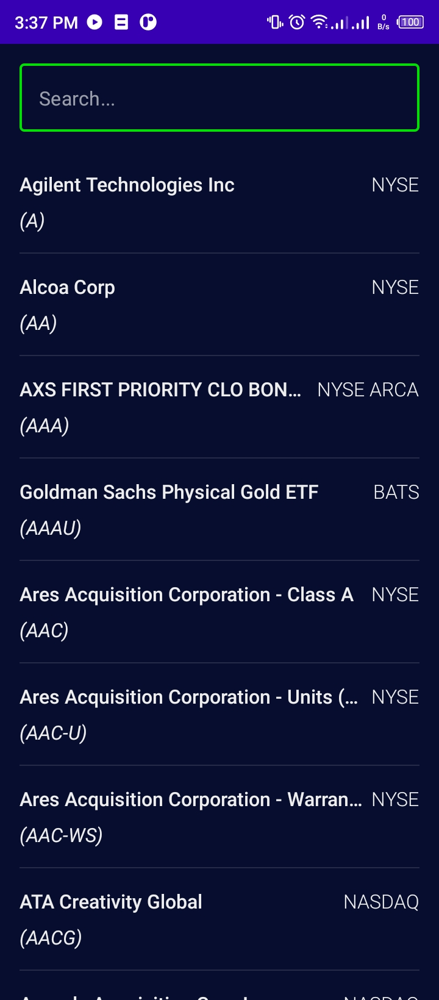
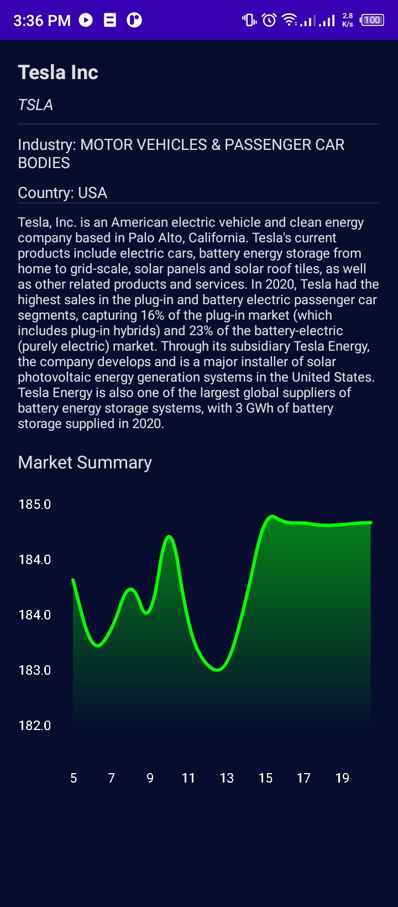

# Stock Market App
Hey there! 👋🏼👋🏼👋🏼

This repository retrieves companies' stock information and displays a chart obtained from the companies' data.
It was written in Jetpack Compose.

### Features:
- Jetpack Compose
- Clean Architecture & MVVM
- Asynchronous operations using Kotlin Coroutines and Flows
- Database and caching using Room
- Dependency Injection using Hilt
- API requests to server via Retrofit
- Drawing on Canvas
- Compose Destinations

### Prerequisite
To build this project, you require:

- Android Studio Canary version and up
- Gradle 7.3.0
- Kotlin 1.6+
- Compose 1.1.1

### Steps

- The application communicates with Alphavantage API whose documentation can be found [here](https://www.alphavantage.co/documentation/).
  You are required to create an account to generate your API key.

- After generating your API key, put them in your local.properties file, which usually
  gets ignored by default by the git version control system (VCS).

- Install the Google Secrets dependency which hides keys so they don't get checked into git VCS.
  Do this by placing "id 'com.google.android.libraries.mapsplatform.secrets-gradle-plugin' in your build.gradle file module and project level respectively.

- Sync the project and Android studio generates a constant representing your API key in your BuildConfig
  class. You can then use this value in your application securely.

#### Screenshots
- Company List Screen
  

- Search Company Screen
  

- Company Info Screen including Stock Chart
  